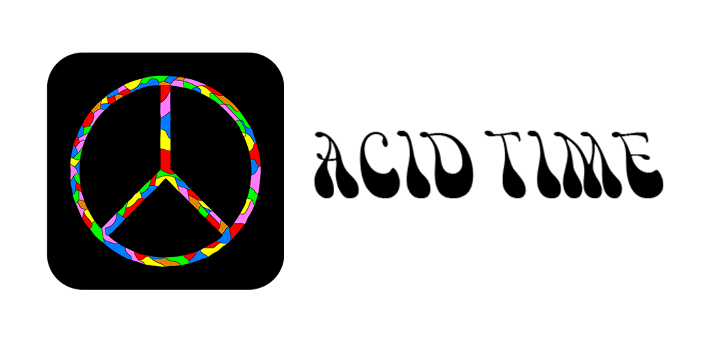

<p align="center">
 
</p>

# ACID TIME :rainbow: :pill:

*Get the current time in an eccentric way.* :rainbow: :pill:

## About :books:

Since I have been researching the *Art Nouveau* movement of late and a lot of acid rock art in the 60s was based on this movement, I decided to write a clock that mimicks that art style.

## Download :inbox_tray:

- ***LSD*** (v.1.0.0):
  - ***[Download for Android](https://github.com/iamtheblackunicorn/AcidTime/releases/download/v.1.0.0/AcidTime-v1.0.0-LSD-Release.apk) (15.3 MB)***
  - ***[Download for Mac OSX](https://github.com/iamtheblackunicorn/AcidTime/releases/download/v.1.0.0/AcidTime-v1.0.0-LSD-Release.app.zip) (13.8 MB)***

## Building for Android :hammer:

Make sure that you have the following programs installed:

- Flutter SDK
- Dart SDK
- Android Studio
- Android SDK
- Java JDK
- Git

After you have installed these, run this command to generate a keystore for the app.

```bash
$ keytool -genkey -v -keystore key.jks -keyalg RSA -keysize 2048 -validity 10000 -alias key
```

After having done that, move the Java keystore to `android/app` and fill in the fields for the keystore password in the file `android/app/key.properties`.

Finally, run these commands:

```bash
$ flutter pub get
$ flutter build apk
```

You have now generated a release build of *Acid Time*.

## Building for Mac OSX

Make sure that you have the following programs installed:

- Flutter SDK
- Dart SDK
- Xcode

Run these commands:

```bash
$ flutter pub get
$ flutter build macos
```

## Changelog :black_nib:

### Version 1.0.0: ***LSD***

- upload to GitHub
- initial release

## Note :scroll:

- *Acid Time :rainbow: :pill:* by Alexander Abraham :black_heart: a.k.a. *"The Black Unicorn" :unicorn:*
- Licensed under the MIT license.
